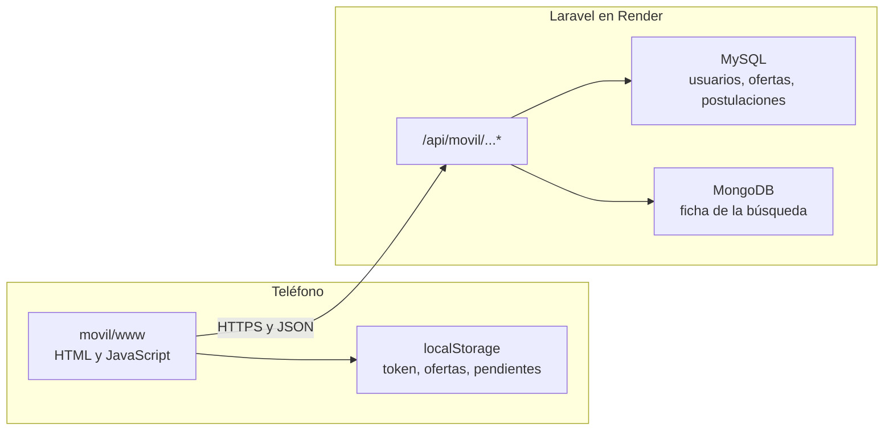
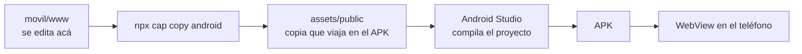
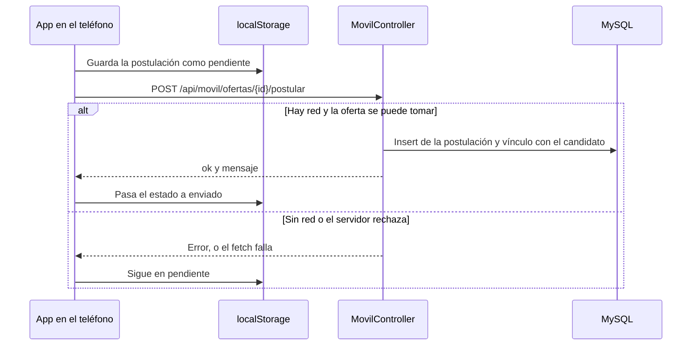

# TalentLink — Aplicación móvil (APK)

Documento para explicar cómo se construyó la aplicación de Android, qué archivos intervienen y cómo se comunica con el sistema web. Complementa `docs/dominio.md`.

**Integrantes:** Appes Agustina, Benitez Tiara Guadalupe  
**Institución:** Escuela Normal Superior N.º 10 — Anexo Comercial San Antonio  
**Materia:** Lenguaje Generador de Informes (LGI) — Análisis de Sistemas, 2.º año — 2026

La aplicación es solo para **candidatos**. Empresas y personal de RRHH siguen usando el sitio web.

---

## 1. Qué pide el trabajo y qué hicimos

El trabajo pide un APK que:

1. Reciba datos del servidor de forma asincrónica.
2. Guarde datos en el teléfono y los transmita también de forma asincrónica.
3. Deje la consulta y el alta en PHP (Laravel), no en la app.

TalentLink ya era un sistema web (Laravel, MySQL y MongoDB) publicado en `https://talentlink-laravel.onrender.com`. La app no copia ese sitio adentro de un visor. Tiene pantallas propias y le pide datos al servidor por HTTP, en JSON.

Eso cubre el enunciado sin rehacer el sistema:

- **Recibir:** al abrir Ofertas, la app hace un GET y muestra lo que responde PHP.
- **Guardar y transmitir:** al postularse, primero guarda la postulación en el teléfono y después hace un POST. Si no hay red, queda guardada y se puede reintentar.
- **PHP:** `MovilController` hace la consulta de ofertas y el insert de la postulación.

---

## 2. Cómo está armada

Hay dos partes.

| Parte | Dónde vive | Qué hace |
| --- | --- | --- |
| Teléfono | Carpeta `movil/` | Pantallas, menú y almacenamiento local |
| Servidor | El proyecto Laravel de siempre | Login, registro, listado de ofertas y alta de la postulación |

La app se empaqueta con **Capacitor 8**. Qué es, cómo copia las pantallas y cómo se compila en Android Studio está en la sección 3. El identificador es `com.talentlink.app` y el nombre visible es TalentLink.



La dirección del servidor está fija en la primera línea de `movil/www/app.js`. El usuario no la escribe.

```javascript
const SERVIDOR = 'https://talentlink-laravel.onrender.com';
```

Cada pedido usa `fetch`. Es asincrónico: la pantalla no se congela y, mientras espera, se muestra el cartel de carga. El origen de la app dentro del teléfono es `https://localhost`. El servidor permite ese llamado (CORS de las rutas `api`).

---

## 3. Qué es Capacitor y cómo trabaja con Android Studio

Capacitor es la herramienta que convierte las pantallas de `movil/www` en una aplicación que Android puede instalar. No se reescribió TalentLink en Java ni en Kotlin. El login, el feed y el menú siguen siendo HTML, CSS y JavaScript.

### Qué es el proyecto nativo que las rodea

Un archivo HTML no se instala en el teléfono. Android instala un APK, y un APK sale de un proyecto nativo: código y configuración que Android Studio compila para ese sistema. Capacitor arma ese proyecto y deja las pantallas adentro, como contenido. Por eso se dice que les pone un proyecto nativo alrededor. Las pantallas no pasan a ser Java. El Java es el marco que las abre.

Ese marco es la carpeta `movil/android`. Ahí está lo que el sistema reconoce como aplicación:

- **`MainActivity.java`.** Es la pantalla nativa. En este proyecto no tiene lógica propia: hereda de `BridgeActivity`, la clase de Capacitor. Al tocar el ícono, Android ejecuta esa clase y Capacitor abre el visor con los HTML.
- **`AndroidManifest.xml`.** Le dice al sistema el nombre del paquete (`com.talentlink.app`), qué actividad arranca y qué permisos pide. El único que usa esta app es internet.
- **Gradle** (`build.gradle` y el wrapper). Es el armado: qué versión de Android, qué librerías bajar y cómo producir el APK.
- **`assets/public`.** La copia de `movil/www`. No es código nativo. Viaja empaquetada para que el visor la lea sin internet.

El teléfono, entonces, abre una app nativa de verdad. Lo primero que corre es `MainActivity`. Esa clase no dibuja el login: le pide al WebView que muestre `index.html`. A partir de ahí todo lo que el usuario ve es la web local, y lo nativo queda de soporte (ícono, permiso de red, ciclo de vida de la app).

Tampoco es el sitio de Render abierto en el navegador del teléfono. Esos HTML van **dentro** del APK. Al abrir la app no se descarga la página del servidor: ya está en el dispositivo. Del servidor solo llegan los datos, en JSON.

### Cómo funciona

`movil/capacitor.config.json` fija tres datos: el id `com.talentlink.app`, el nombre TalentLink y `webDir`, que apunta a la carpeta `www`. Esa carpeta es la que se edita.

El paso que une las pantallas con Android es copiarlas:

```text
npx cap copy android
```

Se corre desde `movil`. Copia `movil/www` a `movil/android/app/src/main/assets/public`. Esa copia es la que entra en el APK. El proyecto Android se creó una vez con Capacitor; no se vuelve a crear en cada cambio.

Cuando el teléfono abre la app, la librería de Capacitor levanta un WebView: un navegador embebido, sin barra de direcciones, que muestra esos archivos locales. Por eso el origen dentro de la app es `https://localhost`. Desde ahí `app.js` llama al servidor con `fetch`, por HTTPS.

Capacitor también puede usar plugins para hablar con el teléfono (cámara, archivos, GPS). Este APK no trae plugins extra. En `movil/package.json` solo están el núcleo de Capacitor y la plataforma Android. Alcanza para mostrar pantallas, guardar texto en `localStorage` y salir a internet. No alcanza para dejar un PDF guardado en una carpeta del teléfono.



### Cómo trabaja con Android Studio

Capacitor deja en `movil/android` un proyecto Android común, con Gradle. Android Studio no es el editor de las pantallas. Compila el cascarón nativo y arma el APK.

1. Se abre la carpeta `movil/android`, no la raíz de Laravel.
2. Sync (el elefante) descarga las librerías, incluida la de Capacitor para Android, y prepara el módulo.
3. **Build → Build Bundle(s) / APK(s) → Build APK(s)** junta tres cosas: el código nativo de Capacitor, la copia de `www` que está en `assets`, y el `AndroidManifest` con el permiso de internet.
4. Sale `app-debug.apk`. El nombre que ve el usuario, TalentLink, sale de `appName` en la configuración de Capacitor.

Si se cambia `index.html` o `app.js` y se compila sin correr antes `npx cap copy android`, Studio empaqueta la copia vieja. Las pantallas nuevas no entran al APK.

Android Studio, en esta máquina, trae Java 25. El Gradle del proyecto no corre con esa versión y Capacitor pide Java 21. El JDK queda indicado en el proyecto; el detalle está en la sección 5.

En una frase: Capacitor mete nuestras pantallas en un proyecto Android, y Android Studio compila ese proyecto. Laravel no se compila ahí. Sigue en el servidor.

---

## 4. Pantallas

Todo está en dos archivos: `movil/www/index.html` y `movil/www/app.js`. No hay un framework de pantallas.

1. **Iniciar sesión.** Correo y contraseña de un candidato.
2. **Crear cuenta.** Nombre, apellido, correo y contraseña. Crea un usuario con rol candidato.
3. **Ofertas.** Listado de ofertas publicadas, parecido al feed de la web.
4. **Postulaciones.** Lo que la persona postuló desde el teléfono, con estado pendiente o enviado.
5. **Menú inferior.** Pasa de Ofertas a Postulaciones. No se ven las dos a la vez.
6. **Cargando.** Se muestra en cada pedido al servidor.

Salir borra el token y el nombre del teléfono y vuelve al login. No borra las ofertas ni las postulaciones guardadas.

---

## 5. Procedimiento para generar el APK

El APK se genera en **Android Studio**, abriendo la carpeta `movil/android` (no la raíz del proyecto Laravel).

1. Abrir Android Studio y elegir esa carpeta.
2. Esperar el Sync de Gradle (el ícono del elefante) hasta que termine sin error.
3. Menú **Build → Build Bundle(s) / APK(s) → Build APK(s)**.
4. El archivo queda en `movil/android/app/build/outputs/apk/debug/app-debug.apk`.

Ese nombre `app-debug` es el del archivo de salida. Al instalarlo, el teléfono muestra **TalentLink**.

Si se cambia algo de `movil/www` (textos, colores, lógica), antes de volver a compilar hay que copiar la web al proyecto Android:

```text
npx cap copy android
```

Ese comando se corre desde la carpeta `movil`. Si no se corre, el APK sigue trayendo las pantallas viejas.

### Java para compilar

Android Studio trae Java 25. El Gradle de este proyecto (8.14) no corre con esa versión. El proyecto usa **Java 21**, indicado en `movil/android/gradle.properties` (`org.gradle.java.home`) y en el JDK de Gradle del IDE (`jbr-21`). Con Java 17 tampoco compila, porque Capacitor pide Java 21.

### Cuándo hace falta un APK nuevo

| Cambió | Qué hay que hacer |
| --- | --- |
| Pantallas o `app.js` (`movil/www`) | `npx cap copy android` y un APK nuevo |
| Solo PHP, rutas o vistas del sitio | Subir el proyecto a Render. El APK instalado sigue sirviendo |

---

## 6. Archivos que intervienen

### En el teléfono

| Archivo | Rol |
| --- | --- |
| `movil/www/index.html` | Estructura de login, registro, feed y menú |
| `movil/www/app.js` | Pedidos al servidor, carga y datos locales |
| `movil/www/logo.jpg` | Logo, el mismo de la web |
| `movil/capacitor.config.json` | Id de la app, nombre y carpeta `www` |
| `movil/android/` | Proyecto que abre Android Studio |
| `movil/android/app/src/main/AndroidManifest.xml` | Permiso de internet. Solo habla por HTTPS |

### En el servidor

| Archivo | Rol |
| --- | --- |
| `routes/api.php` | Las cuatro rutas de la app. Laravel les pone el prefijo `/api` |
| `bootstrap/app.php` | Registra ese archivo de rutas |
| `app/Http/Controllers/MovilController.php` | Validación, consultas e insert |
| `app/Models/User.php` | El campo `api_token` se puede guardar y no se muestra en JSON |
| `database/migrations/2026_10_01_060200_add_api_token_to_usuarios_table.php` | Columna `api_token` en `usuarios` |
| `resources/views/layouts/app.blade.php` | Aviso de descarga, solo para candidatos en Android |
| `public/TalentLink.apk` | El archivo que descarga el celular. El nombre tiene que ser exactamente ese |

La web sigue usando `routes/web.php` y la sesión de Laravel. La app no usa esas rutas ni el token CSRF de los formularios.

---

## 7. Las cuatro APIs

Todas responden JSON. Los mensajes de validación están en el controlador, en español, con `$request->validate()`.

La app manda `Accept: application/json` y `Content-Type: application/json`. Si hay sesión iniciada, agrega `Authorization: Bearer` y el token.

### POST `/api/movil/login`

Entra un candidato que ya existe.

Cuerpo: `correo`, `password`.

PHP busca el correo en `usuarios`, compara la contraseña con `Hash::check` y exige rol candidato (`roles_id` 3) con perfil en `candidatos`. Si no, responde 422 con `mensaje`.

Si está bien, crea el token y responde:

```json
{ "ok": true, "token": "...", "nombre": "Luna", "apellido": "Pérez" }
```

### POST `/api/movil/registro`

Crea la cuenta desde el teléfono.

Cuerpo: `nombre`, `apellido`, `correo`, `password`, `password_confirmation`.

En una transacción inserta el usuario (rol 3, contraseña hasheada) y el perfil del candidato. Después responde igual que el login: token, nombre y apellido.

### GET `/api/movil/ofertas`

Pide el token. PHP busca al candidato y trae las ofertas con `estado_ofertas_id = 1` (publicada), con la búsqueda y la empresa.

El detalle de la búsqueda (modalidad, ciudad, vacantes, descripción) no está en MySQL. Está en MongoDB, colección `solicitudes`. `Busqueda::hidratarFichas()` lo carga y lo deja en `ficha`. Por eso la app no usa una relación `detalle`.

Cada oferta llega así: `id`, `puesto`, `empresa`, `modalidad`, `ciudad`, `vacantes`, `descripcion`, `requiere_cv`, `ya_postulada`.

### POST `/api/movil/ofertas/{id}/postular`

Pide el token. PHP rechaza la oferta si ya no está publicada, si pide CV, o si ese candidato ya se postuló. El CV se adjunta solo desde la web.

Si puede, en una transacción:

1. Inserta en `postulaciones` con `etapas_id = 1` (Pendiente de revisión).
2. Vincula al candidato en la tabla intermedia.

Responde `Te postulaste correctamente.`

---

## 8. Cómo funciona el token

La app no usa la sesión de la web (cookie y CSRF). Usa un token propio.

1. PHP genera 60 caracteres al azar.
2. En `usuarios.api_token` guarda el SHA-256 de ese valor, no el token en claro.
3. El token en claro se envía una sola vez, en la respuesta del login o del registro.
4. El teléfono lo guarda en `localStorage` con la clave `token`.
5. En los pedidos siguientes lo manda en `Authorization: Bearer ...`.
6. PHP vuelve a hashear lo que llegó y lo compara con la columna.

Un login nuevo pisa el token anterior. La columna es única y admite nulo. No se instaló Sanctum: para este trabajo alcanza este token.

Si el token falta o no es de un candidato, la respuesta es 401: `Tenés que iniciar sesión.`

---

## 9. Qué se guarda en el teléfono

`localStorage` es el almacenamiento del WebView. Sobrevive si se cierra la app. Se borra si se desinstala o si se limpian los datos.

| Clave | Contenido |
| --- | --- |
| `token` | Token en claro, para el encabezado Authorization |
| `nombre` | Nombre y apellido, para el saludo |
| `ofertas` | Último listado recibido, para mostrarlo sin red |
| `pendientes` | Postulaciones hechas en el teléfono: id, puesto, empresa y estado `pendiente` o `enviado` |

La pestaña Postulaciones **no** pide la lista al servidor. Muestra lo que el teléfono fue guardando. Las etapas que RRHH cambia en la web se ven en el sitio, no en esa pestaña.

### Postularse, paso a paso

Este es el punto del enunciado: guardar en el dispositivo y transmitir después.



El guardado local ocurre **antes** del POST. Si el envío falla, el aviso dice que quedó en el teléfono. En Postulaciones está el botón Reintentar, que vuelve a hacer el POST.

Al cargar ofertas, si alguna viene con `ya_postulada`, el teléfono la marca como enviada. Así no se ofrece de nuevo una postulación que ya existe en el servidor.

---

## 10. Reglas de negocio que la app respeta

Son las mismas del sistema web:

- Un candidato no se postula dos veces a la misma oferta.
- Solo se listan ofertas publicadas (`estado_ofertas_id = 1`).
- La postulación nueva entra en Pendiente de revisión (`etapas_id = 1`).
- Si la oferta pide CV, la app no crea la postulación. El candidato la ve en el listado y el texto le dice que se postule desde la web.
- Registro y login de la app solo crean o aceptan el rol candidato.

La contraseña se guarda con el hash de Laravel, igual que en el registro web.

---

## 11. Cómo se descarga

El APK no está en Play Store. Se publica como archivo del propio sitio:

`https://talentlink-laravel.onrender.com/TalentLink.apk`

Ese archivo es `public/TalentLink.apk`. En Linux el nombre distingue mayúsculas: `TalenLink.apk` o `talentlink.apk` dan 404. Hay que copiar el `app-debug.apk` generado, con este nombre, y subir el cambio para que Render lo publique.

En la web, un candidato que entra desde un celular Android ve un aviso con el enlace de descarga. La condición está en `resources/views/layouts/app.blade.php`: usuario candidato y agente `Android`. En la computadora, y con otros roles, el aviso no aparece. En un iPhone el APK no se puede instalar, así que tampoco se muestra.

Android pide permiso para instalar desde orígenes desconocidos, porque no viene de la tienda.

---

## 12. Diferencia con el login de la web

El sitio web usa sesión: cookie, token CSRF en el formulario y código 419 si ese token ya no coincide (pestaña vieja, botón atrás o un deploy en el medio). En ese caso la web vuelve al login con el texto «La página expiró. Volvé a intentar.».

La app no pasa por ahí. Sus rutas están en `routes/api.php`, sin la verificación CSRF de los formularios web. Por eso un 419 de la página de login no es un fallo del APK.

---

## 13. Qué decir si preguntan

**¿Qué es Capacitor y qué hace Android Studio?**  
Capacitor copia el HTML y el JavaScript de `movil/www` adentro de un proyecto Android. Android Studio abre `movil/android`, sincroniza Gradle y compila el APK. Las pantallas no se programan en Java. El detalle está en la sección 3.

**¿La app es el sitio metido en un WebView?**  
No. El WebView solo muestra el HTML nuestro, que ya viaja dentro del APK. No carga la página de Render. Los datos salen de la API. El sitio web sigue existiendo aparte.

**¿Dónde está la consulta y el insert?**  
En `MovilController`: `ofertas()` consulta y `postular()` inserta. El JavaScript solo pide y muestra.

**¿Qué es lo asincrónico?**  
`fetch` no bloquea la pantalla. La postulación se graba en el teléfono y el envío al servidor va después. Si falla, queda pendiente.

**¿Por qué solo candidatos?**  
El APK es el canal del postulante. Empresa y RRHH gestionan solicitudes, ofertas y etapas en la web.

**¿Por qué no se puede postular desde la app a una oferta que pide CV?**  
El servidor ya sabe guardar el PDF: en la web es obligatorio, de hasta 5 MB, y PHP lo deja en el disco de CV con la ruta en `postulaciones.cv`. El impedimento está en el teléfono, no en esa regla.

La app cumple «guardar y transmitir después» con `localStorage`. Eso solo acepta texto y el cupo ronda los 5 MB para todo el sitio. Un CV de 5 MB, pasado a texto para poder guardarlo, ocupa cerca de un tercio más y no entra. Si se manda el archivo en el momento, sin guardarlo, se pierde la otra parte del enunciado: si se corta la red o se cierra la app, el PDF desaparece y Reintentar no tiene qué enviar. El objeto del archivo vive solo mientras la pantalla sigue abierta.

Para hacerlo bien haría falta otra pieza, que este APK no tiene: el plugin de archivos de Capacitor, para copiar el PDF a una carpeta del teléfono y conservarlo hasta que el POST responda bien. El pedido tampoco puede ir como JSON. `pedir()` arma `Content-Type: application/json`. Un archivo va en `multipart/form-data`, que es otro tipo de pedido. Hoy las dependencias de `movil/package.json` son solo Capacitor core y Android.

Por eso la oferta se muestra, sin botón Postularme, con el texto «Esta oferta pide CV. Postulate desde la web.». Si igual se llama a la API, `postular()` responde 422 y no inserta una postulación sin archivo.

**¿El token es la contraseña?**  
No. La contraseña se verifica una vez y queda hasheada en la base. El token es otra clave, y en la base también está hasheada. El teléfono guarda solo la copia en claro para identificarse.

**¿Hace falta internet para ver ofertas ya cargadas?**  
No. Si el GET falla y hay un listado anterior, se muestra ese, con el aviso de que no hay conexión.

**¿La pestaña Postulaciones es el estado real del proceso?**  
No. Es la cola local (pendiente de envío o ya enviada). El seguimiento por etapas lo ve el candidato en la web.
